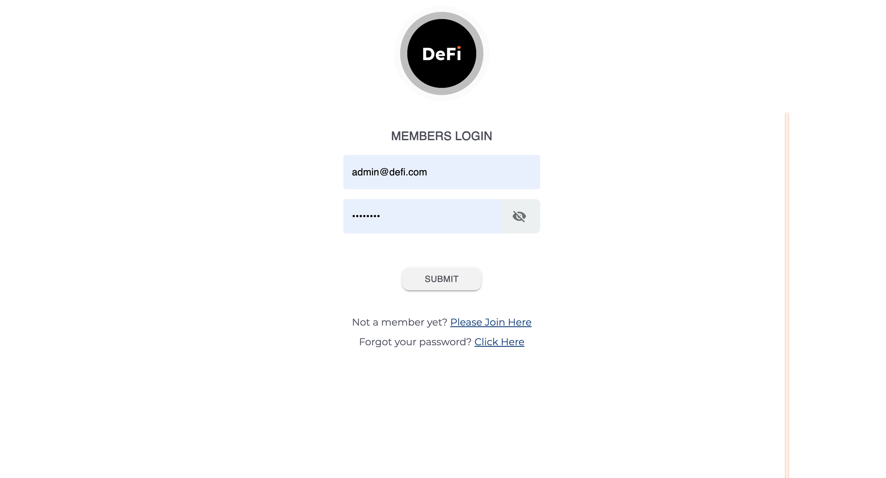
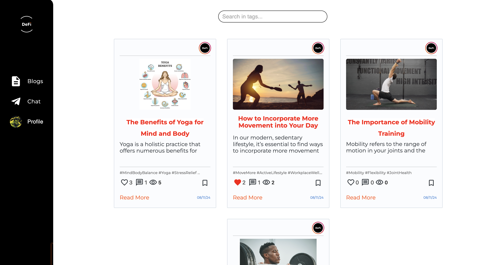
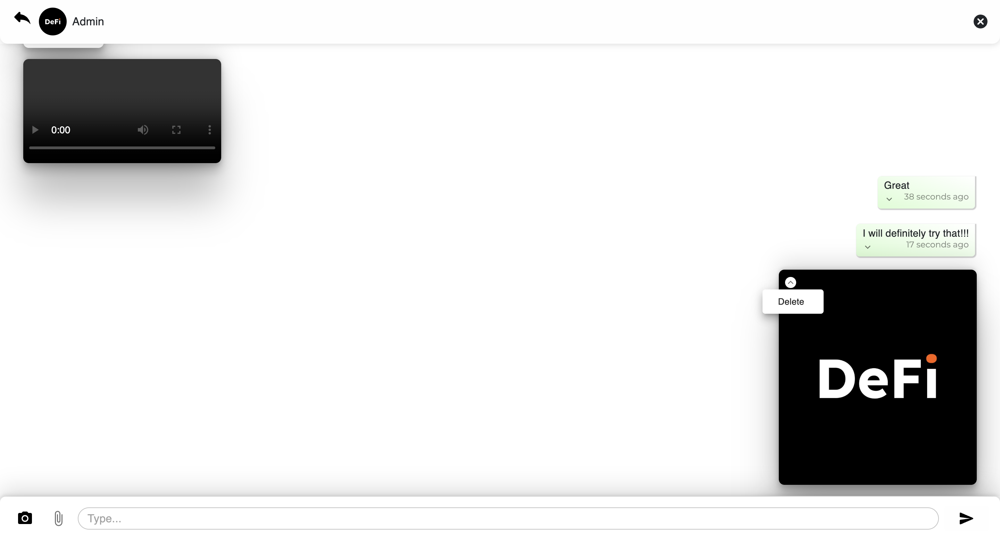
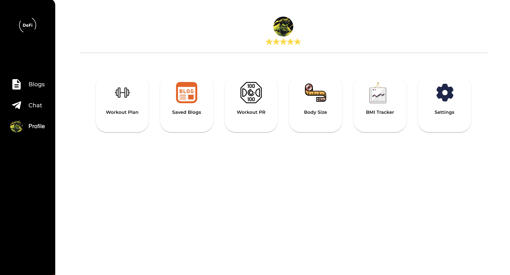
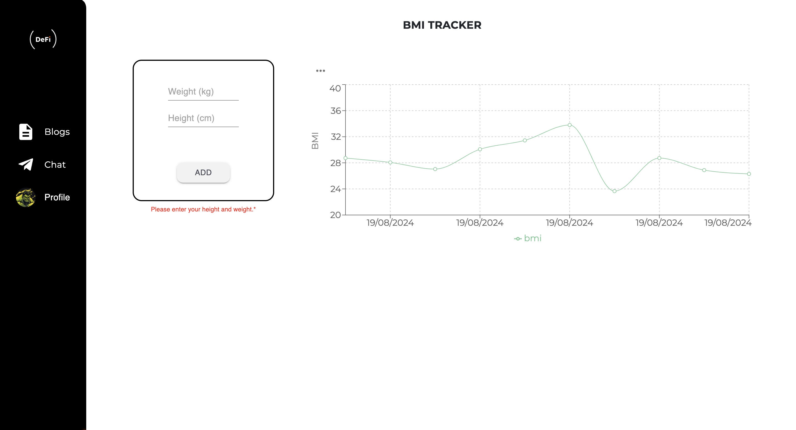
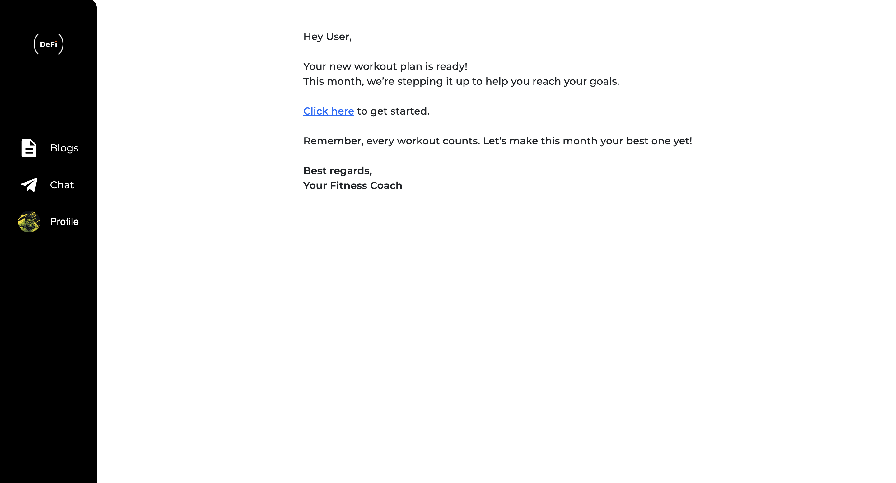
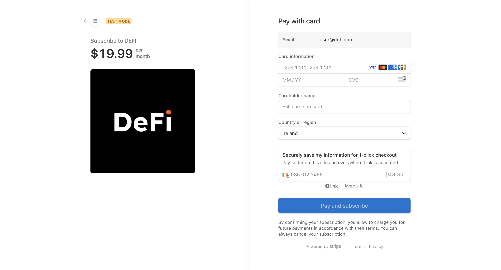
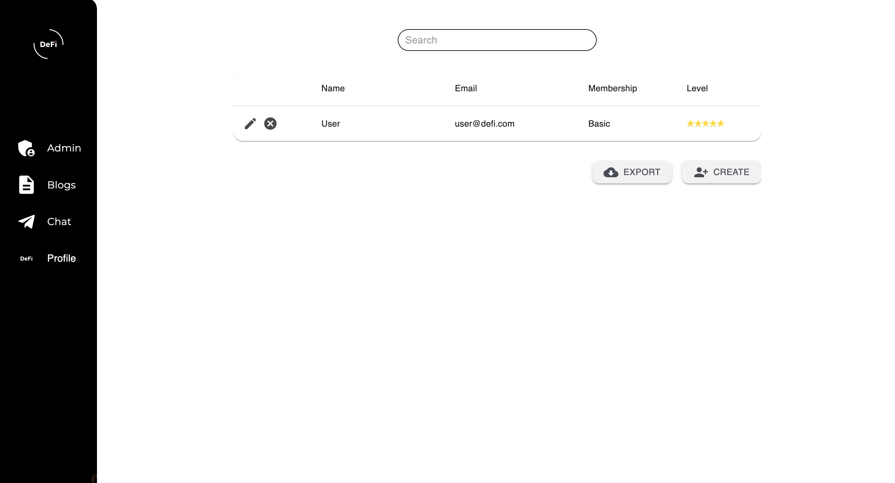

# DEFI Fitness App - A Fullstack Project

  The DEFI Fitness Platform is a dynamic and responsive web application designed for personal trainers and their clients, offering a comprehensive set of features to enhance the fitness experience. Users can personalize their profiles, track body metrics, and interact with blogs shared by the admin. Premium members benefit from exclusive features like personalized workout plans and direct messaging with their trainers, including photo and file sharing, all powered by secure Stripe payments. Administrators can engage with the community through blog posts and one-on-one communication with premium users, making this platform an all-in-one solution for fitness management.  

 

 You can use the login details below to have a quick look:

Email: admin@defi.com or user@defi.com

Password: 12345678

Stripe Test Card: 4242 4242 4242 4242 / Date: Any Further Date / CVV: Any Number / Name: Any Name 

## Starting the App as A User

#### 1. Register - Login - Forgot Password

  Complete the required information to get started with the app. For your security, each step is protected and supported by Nodemailer.

 

 
 

#### 2. Blogs 

 Read, like, comment on, or save for later any blogs created by the admin.

 

 
 

#### 3. Chat 

 Instantly message with your coach, and send photos, videos, and files. 

 

 
 

#### 4. Profile 

 Have a personalized profile. 

 

 
 

#### 5. Track Your Progress 

 Track every aspect of your body's progress and visualize this data through graphs. BMI, Body Size, Workout PR etc. 

 

 
 

#### 6. Workout Plan

 Access the workout program sent by your coach in your profile.

 

 
 

#### 7. Update or Cancel Membership

Pay securely with Stripe and receive your invoice or cancellation confirmation via email.

 

 
 

## Starting the App as an Admin

#### 1. Create, Update or Delete a Blog

 As an admin, create blogs freely using Jodit.

 

 
 

#### 2. Create Workout Plan

 Share personalized workout programs for individuals or groups that users will see in their profiles.

 

 
 

#### 3. Manage Members

Manage members by reviewing and editing their profiles and levels. You can also export the details to your device in Excel format.

 

 
 

Feel free to contact me for future projects:

  

    
    
  

